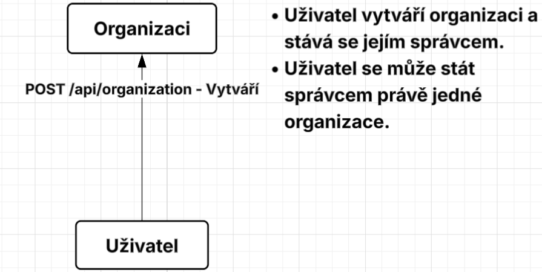
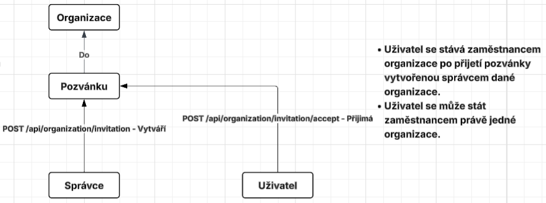
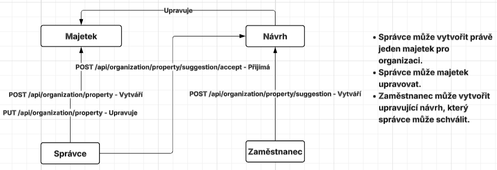
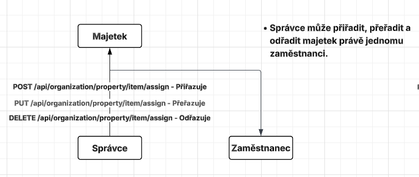

# Invenire

Aplikace bude navržena jako klasická webová aplikace, která se skládá ze dvou hlavních částí. **Backendový server** bude plnit klíčové úlohy, jako je zpracování a správa dat, zajištění autentizace a autorizace uživatelů a implementace hlavní logiky aplikace. **Frontendový klient** bude sloužit jako uživatelské rozhraní, jehož cílem je nabídnout přehledné a intuitivní grafické prostředí pro uživatele.

## Backend

Backend bude implementován pomocí **ASP.NET Core** ve formě **REST API**. Autentizace a autorizace uživatelů bude řešena prostřednictvím **JWT (JSON Web Token)**. Pro správu dat bude server využívat databázi **MySQL**.

## Frontend

Frontend bude implementován pomocí javascript frameworku **Vue**.

## Hlavní funkce

Klíčovou funkcí aplikace Invenire bude správa a údržba majetku organizace. Každá organizace bude tvořena jedním správcem a několika zaměstnanci, kteří budou zodpovědní za jim přidělený majetek.

Správce bude mít možnost načítat majetek z různých formátů nebo jej zadávat ručně. Bude mít možnost jej postupem času upravovat a schvalovat návrhy na úpravy od zaměstnanců.

Aplikace umožní generování QR kódů, které bude možné umístit na jednotlivé položky majetku. Tyto QR kódy budou hrát klíčovou roli při provádění inventury.

Jak již bylo naznačeno, správce bude moct zahájit inventuru. Zaměstnanci pak budou skenovat QR kódy svěřeného majetku a tím proces inventury realizovat.

Všechny provedené inventury budou archivovány a bude možné z nich vytvářet různé statistiky.

## Technické podrobnosti

