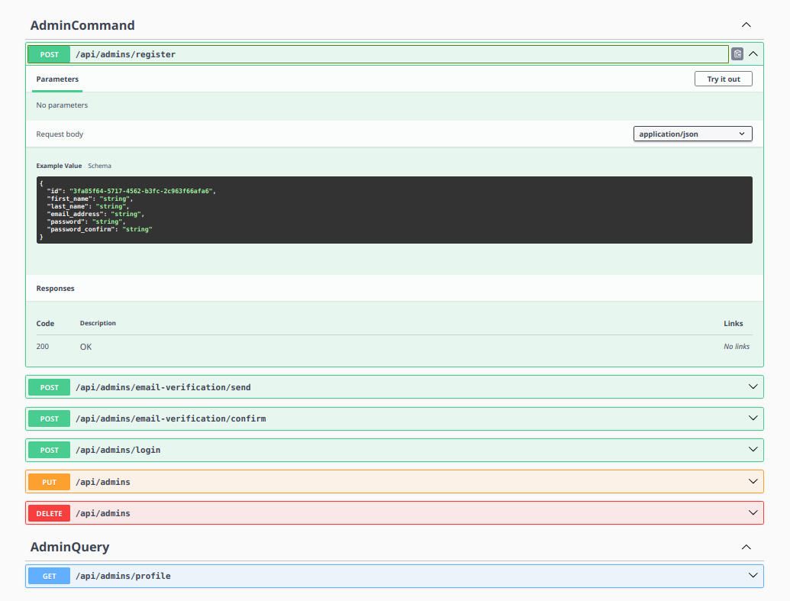

# Invenire Server

## Jak aplikaci spustit? *(Development)*

K úspěsnému spuštění aplikace stačí:

- **Docker**

Nainstalovat si ho můžete [zde](https://www.docker.com/). Po úspěšné instalaci, stačí spustit command:

```bash
docker compose -f docker-compose.dev.yml up --build
```

Případné nastavení buildu, můžete dodělat nebo upravit v [docker souboru](./docker-compose.dev.yml).

V development modu je možné otevřít **swagger**, kde si můžete vyzkoušet veškeré endpointy.


